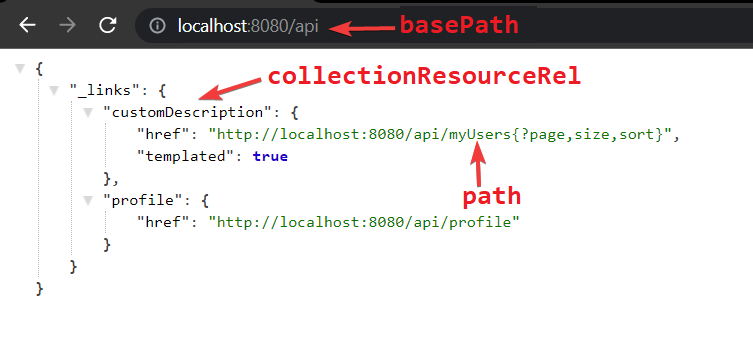

# [Spring Data REST](https://docs.spring.io/spring-data/rest/docs/current/reference/html/#preface)

Refer official Documentation for more information : https://docs.spring.io/spring-data/rest/docs/current/reference/html/#preface

##### Spring Data Rest

- Spring Data Rest by default provides us the REST API for CRUD Operations
- We just need to define Entity and Repository Interface of the Entity as we are using Spring Data JPA.
- We are using h2 database to store the data and implemented CommandLineRunner in the main class to save the data.
- By default, Spring Data REST serves up REST resources at the root URI, '/'. There are multiple ways to change the base path. With Spring Boot 1.2 and later versions, you can do change the base URI by setting a single property in application.properties, as follows:\

```properties
spring.data.rest.basePath=/api
```

- If model name is User then all the CRUD Rest Endpoints of the model are available at "users"
  | Model | endpoint|
  |-------|---------|
  |User|users|
  |Employee|employees|
  |Book|books|
- Spring Data REST exposes a collection resource named after the uncapitalized, pluralized version of the domain class the exported repository is handling. Both the name of the resource and the path can be customized by using @RepositoryRestResource on the repository interface.

```java
@RepositoryRestResource(path = "myUsers",collectionResourceRel = "customDescription")
```

